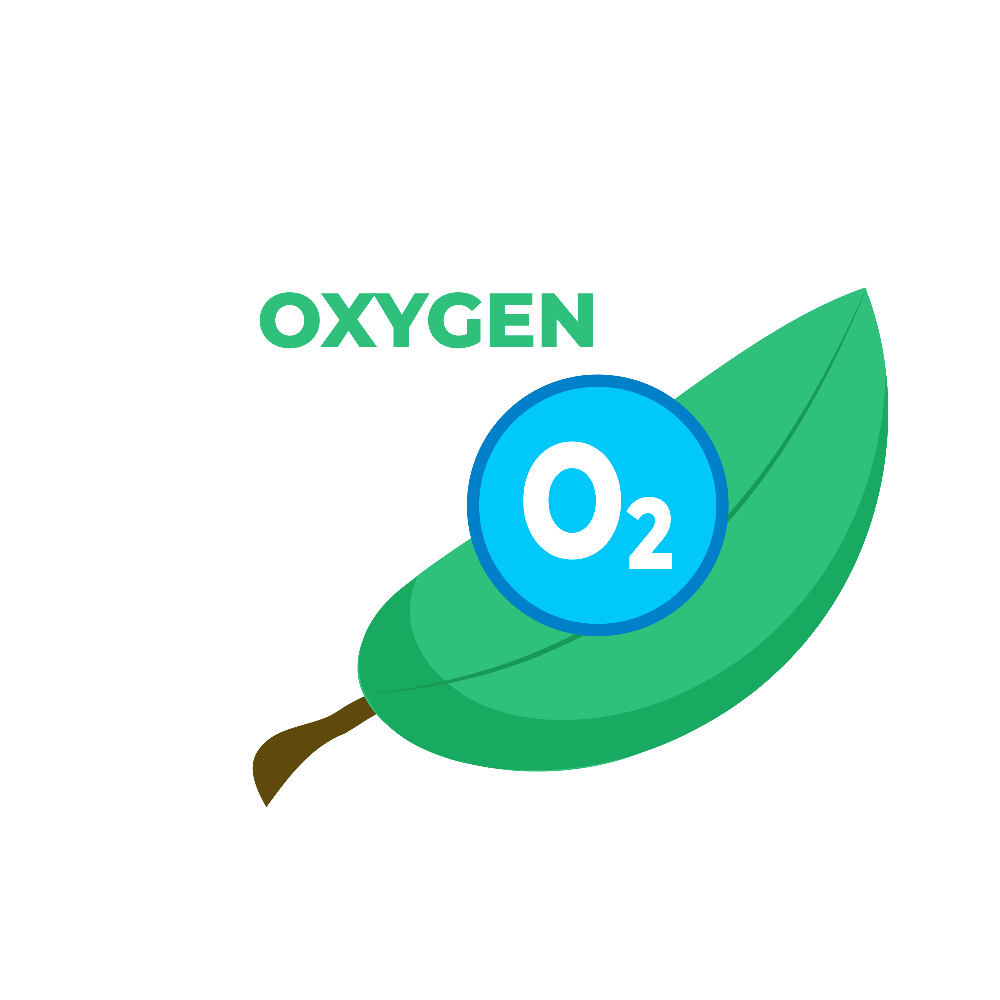

# 💰 Currency

Oxygen

Oxygen is received after a period of 30 minutes with each plant. and gradually increase the rate and value with the [level of the tree](formula.md)

Gemstone

Gems are the currency that can be purchased using the app. Gems can be [converted to oxygen at the exchange rate ](formula.md)

Event Tickets  

Event tickets can only be obtained through events, event tickets can be used to unlock plants in the store

