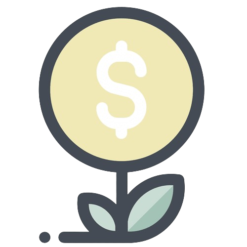
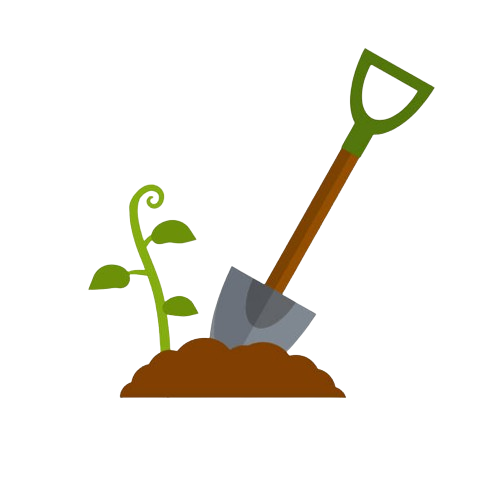
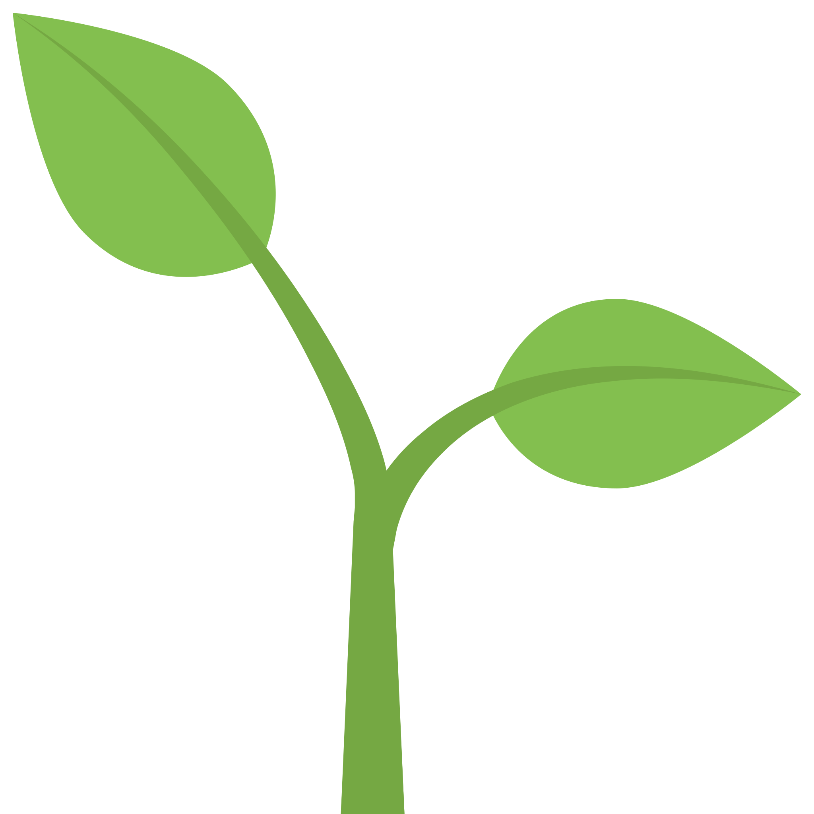

# 📦 Items

Bán cây

thao tác này bán cây đang trồng và nhận được oxygen tương ứng

level 1: 5 oxygen

level 2: 20 oxygen

level 3: 50 oxygen

và chậu cây sẽ không còn được sử dụng

Bón Phân

sử dụng phân bón sẽ giúp cây tăng 1 level ngay lập tức mà không cần phải đợi thời gian thu hoạch oxygen

Phân bón chỉ có thể mua bằng [đá quý](tien-te.md)

Xẻng

xẻng giúp di chuyển cây xang 1 ô, tầng khác trong khu vườn

xẻng chỉ được mua bằng [đá quý](tien-te.md) hoặc tham gia sự kiện

Cây

cây có 3 [cấp độ](cong-thuc.md), có thể dùng [phân bón](items.md#bon-phan) để tăng cấp

