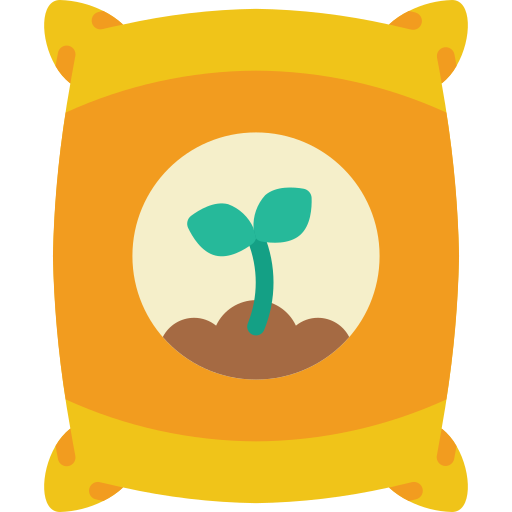

# 📦 Items

Selling Plants

This operation sells the planted plant and receives the corresponding oxygenlevel 1: 5 oxygen

level 2: 20 oxygen

level 3: 50 oxygen,&#x20;

and the plant pot will no longer be used

Manure  

Using fertilizer will help the plant increase by 1 level instantly without having to wait for the oxygen harvest timeFertilizer can only be purchased with [gems](currency.md)

Shovel

Shovel to help move the gas station 1 cell, another floor in the gardenShovel can only be purchased with gems or participate in events

Tree

The plant has 3 levels, you can use fertilizer to increase the level

