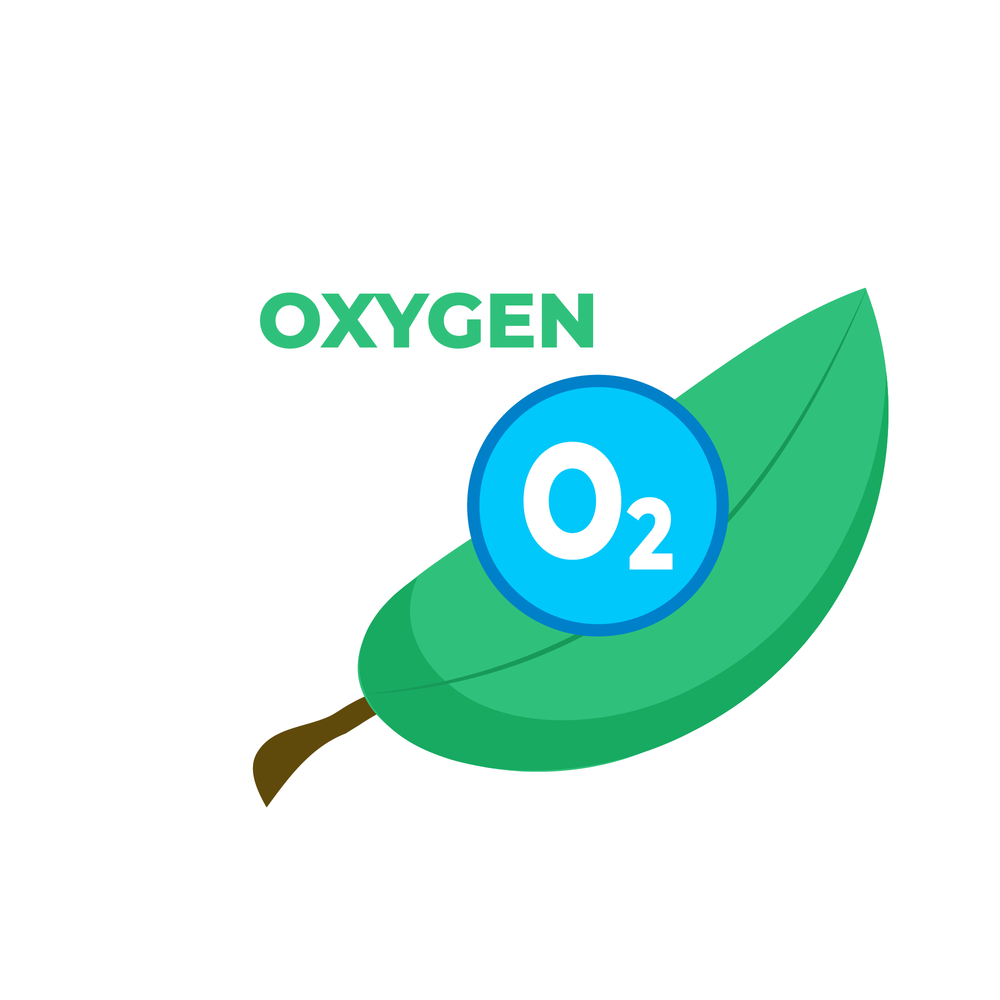

# 💰 Tiền tệ

Oxygen

Oxygen nhận được sau khoảng thời gian là 30 phút với mỗi cây trồng. và tăng dần tỷ lệ và giá trị với [level của cây](cong-thuc.md)

Đá quý

Đá quý là đơn vị tiền tệ có thể được mua bằng ứng dụng.&#x20;

có thể quy đổi [đá quý sang oxygen với tỷ giá](cong-thuc.md):

Vé sự kiện

Vé sự kiện chỉ có thể nhận được thông qua các [sự kiện](su-kien.md)

vé sự kiện có thể dùng mở khóa các cây trong cửa hàng

